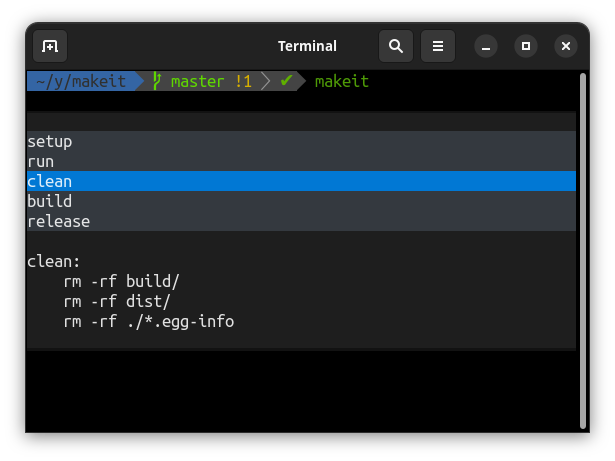

# makeit

**makeit** is an interactive Makefile step picker.

<div align="center">
    <a href="https://github.com/igrek51/makeit">GitHub</a>
    -
    <a href="https://pypi.org/project/makit">PyPI</a>
</div>



## Installation
```shell
pip3 install makit
```

This will install `makeit` executable.

## Usage
Run it in the directory of your Makefile:

```shell
makeit
```

It will show a list of available Makefile steps. Find one and hit Enter to run it with `make`.
